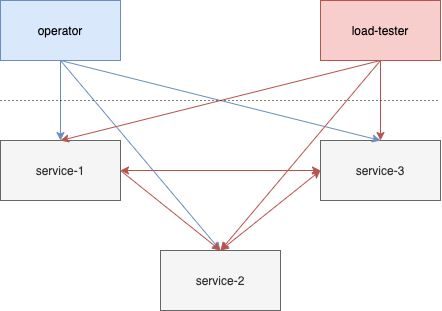
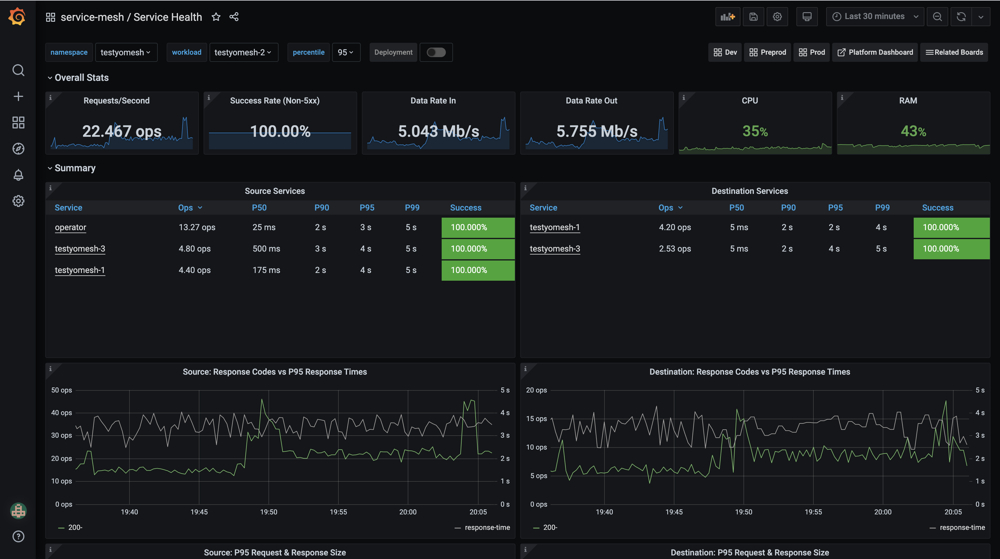

# testyomesh

## Enough with the memes, what is this?

I've been upgrading [Istio](https://github.com/istio/istio) pretty much since it was born.  I've encountered my fair share of bugs during the upgrade process, and the vast majority are due to nuances in my configursation or environment, rather than obvious bugs in core components.

Therefore, I accept that when testing Istio releases in my environment, I'm going to find issues.  This project is about surfacing those issues as soon as possible during release testing in a qualifying environment.

### How?

Like this:

This is what each of the components do:

#### simple-service

`simple-service` is what it says, a simple `http` web server which has a few endpoints for poking:

 - `/instant?code={code}` - to return an instant response with a given status code
 - `/delayed?code={code}` - as `instant`, but with a random delay (or fixed, if you pass `deplay={delay}`)
 - `/downstream?servers=another-app/instant` - allows you to tell the server to make a subsequent downstream request to another app, and return an aggregate response

#### operator

Think of `operator` as a chaos monkey.  It runs tasks in `lib/apps/tasks` to intentionally create some chaos that _should not_ cause any errors!  Currently implemented tasks are:

 - `auth-policy` - creates and deletes a `security.istio.io/v1beta1/AuthorizationPolicy` every 5-10 minutes, which triggers an inbound listener reload.  You need to be on `1.6+` for this to work (logs errors otherwise).
 - `restart-simple-service` - every 5-10 mins will pick a random `simple-service` and rolling restart it

#### load-tester

Load tester looks at your configuration and attempts to think of all the different ways it can poke your services, by:

 - Calculating each different permutation of request, eg `service1 -> service2 -> service3`, or perhaps `service3 -> service1`
 - Adding in all the different HTTP methods to that mix, eg `service1 -- GET --> service2`, or perhaps `service2 -- PATCH --> service1`
 - Using a mixture of instant and delayed routes, eg `service1 -- GET /instant --> service3`, or perhaps `service2 -- POST /delayed --> service3`
 - Requesting different status codes too, eg: `service1 -- POST /instant?code=204 --> service2`

It might seem excessive, but the cardinality of the requests will help you find subtle issues such as [this issue with content-encoding on 204 responses](https://github.com/istio/istio/issues/28433).

## How do I know somethings broken?

Well, I'm presuming you're already monitoring, graphing and alerting on the istio request metrics such as `istio_requests_total{response_code=~"5.*"}`.  So that's on you.

## How do I install it

There's a helm chart in the [./helmfile/charts/testyomesh](./helmfile/charts/testyomesh) folder, or you can get [helmfile](https://github.com/roboll/helmfile), and simply type `helmfile sync` from the `helmfile/` folder.

I'll get around to versioned releases when I have time, until then you probably want to store the latest image in your registry, so:

 - `docker pull stono/testyomesh:latest`
 - `docker test stono/testyomesh:latest you-registry:whatever`

 And then update `helmfile/charts/testyomesh/values.yaml` accordingly.

### How about config?

The things you can currently configure are in [./helmfile/charts/testyomesh/values.yaml](./helmfile/charts/testyomesh/values.yaml).  The out of the box configuration will give you `2` load test replicas running `30` threads, `3` simple services, and `1` operator.  This will give you around 150 ops/second.
